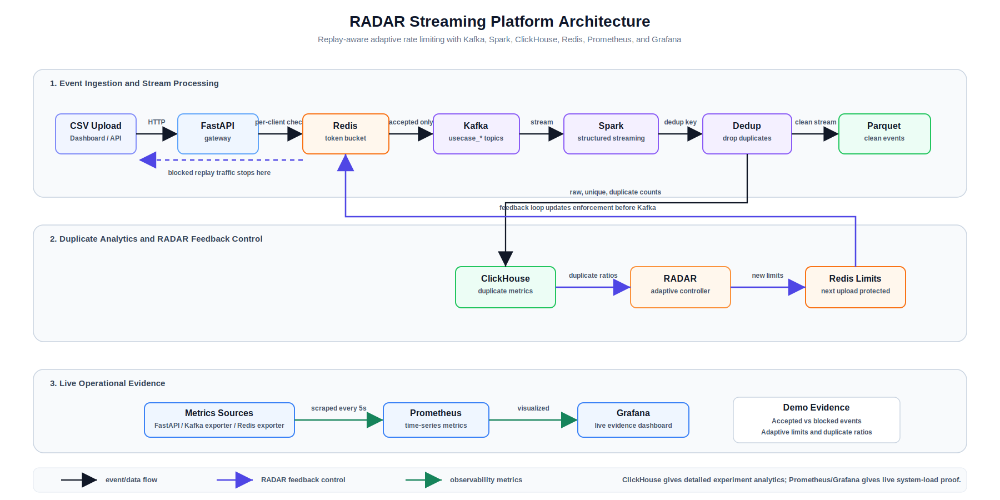
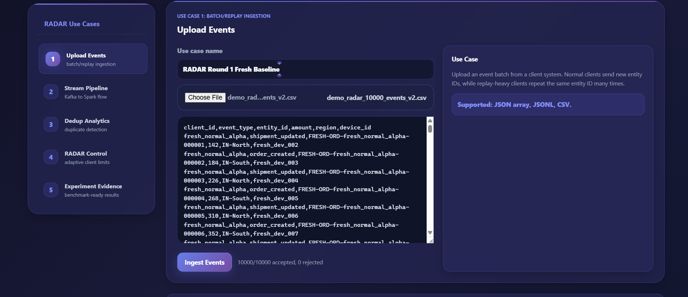
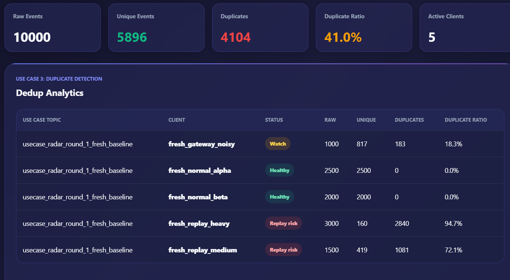
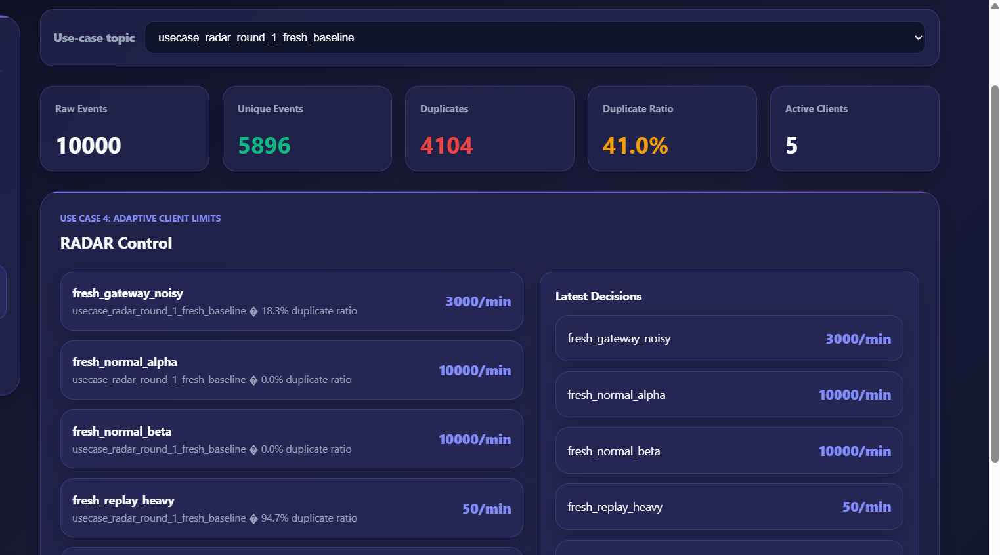
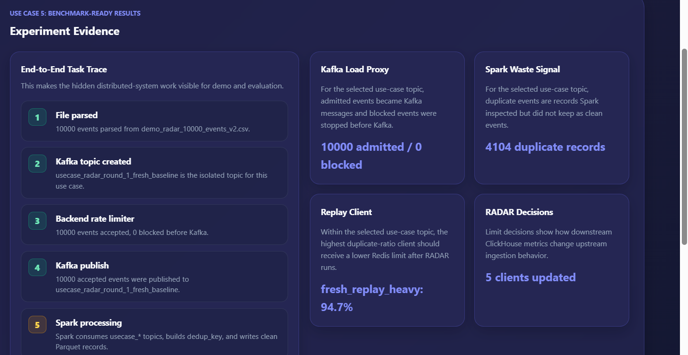
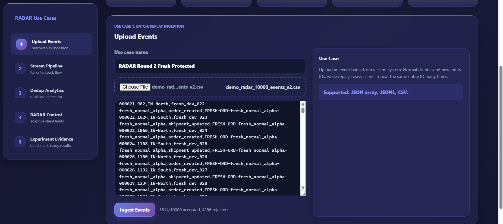
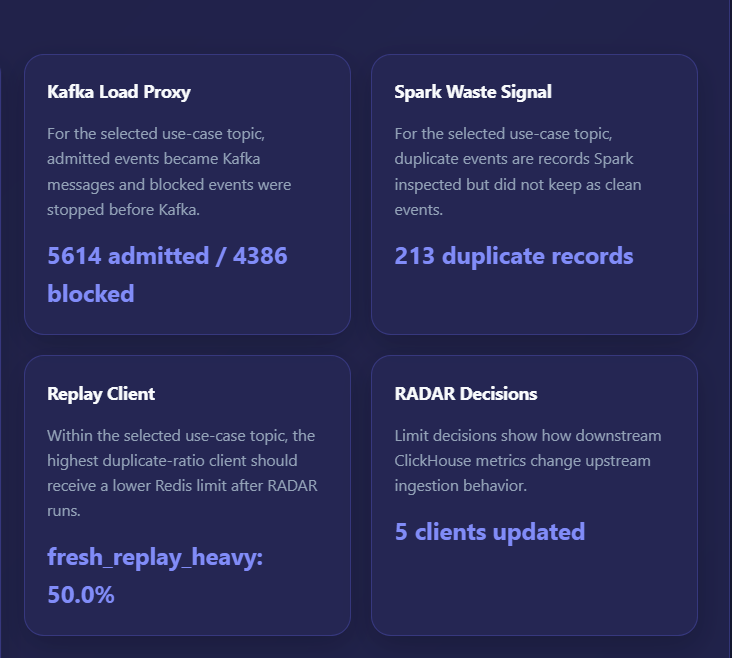
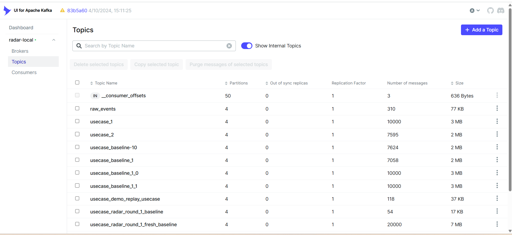

# RADAR Streaming Platform

RADAR is a replay-aware adaptive rate limiting system for real-time big-data streaming pipelines. It detects clients that repeatedly send duplicate or replayed events, then adapts their Redis rate limits so future duplicate-heavy traffic is blocked before it reaches Kafka and Spark.

The project demonstrates a full distributed-system loop:

```text
CSV / dashboard upload
    -> FastAPI gateway
    -> Redis token bucket enforcement
    -> Kafka per-use-case topic
    -> Spark Structured Streaming
    -> clean Parquet storage + ClickHouse duplicate metrics
    -> RADAR adaptive controller
    -> Redis client limits
    -> next upload is protected before Kafka

Operational evidence:
FastAPI / Kafka exporter / Redis exporter
    -> Prometheus
    -> Grafana live evidence dashboard
```

## Problem Statement

Modern event pipelines often receive duplicate events because of retries, backfills, mobile reconnects, client bugs, network failures, and replayed log files. Traditional pipelines usually clean duplicates after ingestion, but Kafka and Spark still spend resources carrying and processing the repeated records.

RADAR focuses on prevention:

> Learn from downstream duplicate metrics, then reduce future upstream load for duplicate-heavy clients.

## Novelty

Most deduplication systems focus on final storage correctness. They answer:

```text
Did the final database stay clean?
```

RADAR answers a different question:

```text
Can the system learn which clients create duplicate waste and reduce future Kafka/Spark load automatically?
```

The core idea is a feedback loop:

```text
Spark detects duplicate behavior
ClickHouse stores per-client metrics
RADAR converts duplicate ratio into client limits
Redis enforces those limits before Kafka
```

## Architecture



```text
                           +----------------------+
                           | Grafana Dashboard    |
                           | live evidence        |
                           +----------^-----------+
                                      |
                           +----------+-----------+
                           | Prometheus           |
                           | time-series metrics  |
                           +----------^-----------+
                                      |
             +------------------------+------------------------+
             |                        |                        |
      FastAPI /metrics          Kafka Exporter           Redis Exporter
             |                        |                        |
             v                        v                        v
+-------------------+       +--------------------+       +------------------+
| CSV / Dashboard   | ----> | FastAPI Gateway    | ----> | Kafka Topics     |
| Event Upload      |       | /usecases/ingest   |       | usecase_*        |
+-------------------+       +---------+----------+       +--------+---------+
                                      |                           |
                                      v                           v
                              +---------------+          +------------------+
                              | Redis         |          | Spark Structured |
                              | Token Bucket  |          | Streaming        |
                              +-------+-------+          +--------+---------+
                                      ^                           |
                                      |                           v
                              +-------+-------+          +------------------+
                              | RADAR         | <------  | ClickHouse       |
                              | Controller    |          | Metrics Store    |
                              +---------------+          +--------+---------+
                                                                  |
                                                                  v
                                                         +------------------+
                                                         | Parquet Clean    |
                                                         | Event Storage    |
                                                         +------------------+
```

## Components

| Component | Role | Port / Location |
|---|---|---|
| FastAPI backend | Accepts events, creates Kafka topics, applies Redis limits, exposes RADAR metrics | `http://localhost:8000`, metrics at `/metrics` |
| Kafka | Distributed event broker | broker `localhost:9092`, internal `kafka:29092` |
| Kafka UI | Kafka browser UI | `http://localhost:8085` |
| Spark | Streaming processor and dedup metric engine | Docker container `radar-spark`, Spark UI `http://localhost:4040` |
| Redis | Token bucket and RADAR client limit store | host `localhost:6380`, container `6379` |
| ClickHouse | Fast analytics store for duplicate metrics | `http://localhost:8123/play` |
| Prometheus | Scrapes FastAPI, Kafka exporter, and Redis exporter metrics | `http://localhost:9090` |
| Grafana | Live evidence dashboard for accepted/blocked events, limits, duplicate ratios | `http://localhost:3000` |
| Kafka exporter | Exposes Kafka topic and broker metrics to Prometheus | `http://localhost:9308/metrics` |
| Redis exporter | Exposes Redis operational metrics to Prometheus | `http://localhost:9121/metrics` |
| Frontend dashboard | Upload, analytics, RADAR decisions, experiment evidence links | `http://localhost:5173` |
| Parquet | Clean deduplicated event storage | `spark/data/clean_events` |

## Project Structure

```text
radar-streaming-platform/
|-- docker-compose.yml
|-- README.md
|-- demo_radar_10000_events_v2.csv
|-- backend-go/
|   `-- backend/
|       `-- main.py
|-- spark/
|   |-- spark_consumer.py
|   |-- data/clean_events/
|   `-- checkpoints/
|-- frontend/
|   |-- src/
|   |-- package.json
|   `-- vite.config.mjs
|-- clickhouse/
|-- docs/
|   `-- images/
`-- simulator/
```

## Data Model

Each uploaded event has fields such as:

```csv
client_id,event_type,entity_id,amount,region,device_id
fresh_normal_alpha,order_created,FRESH-ORD-fresh_normal_alpha-000001,142,IN-North,fresh_dev_002
```

The backend converts CSV rows to event JSON and publishes accepted events to Kafka.

Spark creates a deterministic deduplication key:

```text
dedup_key = SHA256(source_topic + client_id + event_type + entity_id)
```

This means repeated records with the same client, event type, entity, and use-case topic are treated as duplicates.

## RADAR Algorithm

The backend stores a high default limit for new clients:

```text
DEFAULT_LIMIT_PER_MINUTE = 10000
MAX_LIMIT_PER_MINUTE     = 10000
MIN_LIMIT_PER_MINUTE     = 50
```

RADAR updates limits using duplicate ratio:

| Duplicate Ratio | New Limit |
|---|---:|
| `< 5%` | `10000/min` |
| `5% - 30%` | `3000/min` |
| `30% - 70%` | `500/min` |
| `>= 70%` | `50/min` |

Redis keys:

```text
radar:v2:limit:{client_id}    -> adaptive RADAR limit
rate:v2:{client_id}           -> live token bucket state
```

This separation is important. The token bucket is the enforcement mechanism, while RADAR decides how strict each client should be.

## Demo Dataset

The main demo file is:

```text
demo_radar_10000_events_v2.csv
```

It contains 10,000 records across five clients:

| Client | Behavior | Records |
|---|---|---:|
| `fresh_normal_alpha` | normal unique events | 2500 |
| `fresh_normal_beta` | normal unique events | 2000 |
| `fresh_replay_heavy` | high replay duplicates | 3000 |
| `fresh_replay_medium` | medium replay duplicates | 1500 |
| `fresh_gateway_noisy` | mixed normal and duplicate events | 1000 |

## Run The System

### Fast Demo Command

For a clean repeatable demo, run:

```cmd
cd C:\Users\janan\radar-streaming-platform
scripts\demo-all.cmd
```

This resets Redis, ClickHouse metrics, Spark checkpoints, and clean Parquet output, then opens backend, Spark, and frontend terminals.

Open:

```text
Frontend:   http://localhost:5173
Kafka UI:   http://localhost:8085
Prometheus: http://localhost:9090
Grafana:    http://localhost:3000
```

Use this when you want to show the same Round 1 / Round 2 demo again from a clean state.

### Manual Run

### 1. Start Docker Services

```cmd
cd C:\Users\janan\radar-streaming-platform
docker compose up -d
```

Verify:

```cmd
docker ps
```

Expected containers:

```text
radar-zookeeper
radar-kafka
radar-redis
radar-clickhouse
radar-kafka-ui
radar-spark
```

### 2. Start Backend

```cmd
cd C:\Users\janan\radar-streaming-platform\backend-go\backend
.venv\Scripts\activate
uvicorn main:app --reload --port 8000
```

Health check:

```cmd
curl http://localhost:8000/
```

### 3. Start Spark Streaming

```cmd
cd C:\Users\janan\radar-streaming-platform
docker exec -it radar-spark /opt/spark/bin/spark-submit --conf spark.jars.ivy=/tmp/.ivy2 --repositories https://repo1.maven.org/maven2 --packages org.apache.spark:spark-sql-kafka-0-10_2.12:3.5.1 /opt/spark/app/spark_consumer.py
```

If the Spark container was recreated, install the ClickHouse connector inside it:

```cmd
docker exec -u 0 -it radar-spark python3 -m pip install clickhouse-connect==0.7.19
```

### 4. Start Frontend

```cmd
cd C:\Users\janan\radar-streaming-platform\frontend
npm run dev
```

Open:

```text
http://localhost:5173
```

## Dashboard Screenshots

The demo screenshots are stored in:

```text
docs/images/
```

Screenshot files:

```text
docs/images/dashboard-upload-round-1.png
docs/images/dashboard-dedup-round-1.png
docs/images/dashboard-radar-control.png
docs/images/dashboard-evidence-round-1.png
docs/images/dashboard-upload-round-2.png
docs/images/dashboard-evidence-round-2.png
docs/images/kafka-ui-topics.png
```

These images render in GitHub:















## Research Experiment Modes

The backend and dashboard support four experiment modes for paper-style comparison:

| Mode | Backend Behavior | Research Purpose |
|---|---|---|
| `none` | Bypasses Redis rate limiting and accepts every event | Measures worst-case Kafka/Spark load |
| `static` | Uses one fixed Redis token bucket limit for every client: `1000/min` | Shows limitations of ordinary rate limiting |
| `storage_only` | Accepts every event and lets Spark/storage deduplicate later | Represents storage-only deduplication pipelines |
| `radar` | Uses ClickHouse duplicate metrics to set adaptive Redis limits | Proposed RADAR method |

Mode APIs:

```cmd
curl http://localhost:8000/experiment/mode
curl -X POST http://localhost:8000/experiment/mode -H "Content-Type: application/json" -d "{\"mode\":\"radar\"}"
```

Dashboard workflow:

1. Select an experiment mode in the Upload Events section.
2. Upload the same CSV with a unique use-case name.
3. Wait for Spark and ClickHouse metrics.
4. Repeat for `none`, `static`, `storage_only`, and `radar`.
5. In Experiment Evidence, choose which two use-case topics to compare.

Suggested use-case names:

```text
Exp A No Rate Limit
Exp B Static Token Bucket
Exp C Storage Only Dedup
Exp D1 RADAR Learn
Exp D2 RADAR Protected
```

For the RADAR run, upload `Exp D1 RADAR Learn`, click Update RADAR, then upload the same CSV as `Exp D2 RADAR Protected`.

## Experiment Phases

This section explains the project the same way a system evaluation/demo report would.

### Phase 1: Infrastructure Validation

Start all services and verify the distributed stack.

```cmd
docker ps
```

This proves the runtime infrastructure is active: Kafka, Spark, Redis, ClickHouse, and dashboard services.

### Phase 2: Baseline Ingestion

Upload the demo CSV through the dashboard:

```text
Use case name: RADAR Round 1 Fresh Baseline
CSV file: demo_radar_10000_events_v2.csv
```

Expected dashboard result:

```text
10000 accepted, 0 rejected
```

At this point, every uploaded event is admitted. This intentionally creates a baseline where Kafka and Spark carry the full replay workload.

### Phase 3: Kafka Topic Verification

Each use case creates an isolated Kafka topic.

```cmd
docker exec -it radar-kafka kafka-topics --bootstrap-server localhost:9092 --list
```

Expected topic:

```text
usecase_radar_round_1_fresh_baseline
```

Read sample messages:

```cmd
docker exec -it radar-kafka kafka-console-consumer --bootstrap-server localhost:9092 --topic usecase_radar_round_1_fresh_baseline --from-beginning --max-messages 3
```

This proves accepted events reached Kafka.

### Phase 4: Spark Deduplication Metrics

Spark consumes `raw_events` and all `usecase_*` topics:

```python
.option("subscribePattern", "raw_events|usecase_.*")
```

Spark calculates:

```text
raw_events       = all events received from Kafka
unique_events    = countDistinct(dedup_key)
duplicate_events = raw_events - unique_events
duplicate_ratio  = duplicate_events / raw_events
```

Query ClickHouse:

```cmd
docker exec -it radar-clickhouse clickhouse-client --database radar --query "SELECT client_id, sum(raw_events) AS raw, sum(unique_events) AS unique, sum(duplicate_events) AS duplicates, round(sum(duplicate_events)/sum(raw_events),2) AS dup_ratio FROM client_event_metrics WHERE use_case_topic='usecase_radar_round_1_fresh_baseline' GROUP BY client_id ORDER BY duplicates DESC"
```

Expected Round 1 result shape:

```text
fresh_replay_heavy    3000  160   2840  0.95
fresh_replay_medium   1500  419   1081  0.72
fresh_gateway_noisy   1000  817    183  0.18
fresh_normal_alpha    2500 2500      0  0.00
fresh_normal_beta     2000 2000      0  0.00
```

This proves Spark discovered which clients are creating duplicate waste.

### Phase 5: RADAR Adaptive Decision

Trigger RADAR:

```cmd
curl -X POST http://localhost:8000/radar/update-limits
```

Expected decision pattern:

```text
fresh_replay_heavy    -> 50/min
fresh_replay_medium   -> 50/min
fresh_gateway_noisy   -> 3000/min
fresh_normal_alpha    -> 10000/min
fresh_normal_beta     -> 10000/min
```

Verify Redis directly:

```cmd
docker exec -it radar-redis redis-cli -p 6379 GET "radar:v2:limit:fresh_replay_heavy"
```

Expected:

```text
50
```

Normal client:

```cmd
docker exec -it radar-redis redis-cli -p 6379 GET "radar:v2:limit:fresh_normal_alpha"
```

Expected:

```text
10000
```

This proves RADAR changed upstream client behavior using downstream analytics.

### Phase 6: Protected Replay Upload

Upload the same CSV again:

```text
Use case name: RADAR Round 2 Fresh Protected
CSV file: demo_radar_10000_events_v2.csv
```

Observed result:

```text
5614 accepted, 4386 rejected
```

This means 4,386 events were stopped before Kafka.

### Phase 7: Kafka Load Reduction

Check Kafka offsets for the protected topic:

```cmd
docker exec -it radar-kafka kafka-run-class kafka.tools.GetOffsetShell --broker-list localhost:9092 --topic usecase_radar_round_2_fresh_protected
```

The sum of partition offsets should be close to the accepted count:

```text
5614 messages
```

This proves blocked events did not enter Kafka.

### Phase 8: Spark Waste Reduction

Compare Round 1 and Round 2:

```cmd
docker exec -it radar-clickhouse clickhouse-client --database radar --query "SELECT use_case_topic, sum(raw_events) AS kafka_messages, sum(unique_events) AS clean_events, sum(duplicate_events) AS spark_waste, round(sum(duplicate_events)/sum(raw_events),2) AS dup_ratio FROM client_event_metrics WHERE use_case_topic IN ('usecase_radar_round_1_fresh_baseline','usecase_radar_round_2_fresh_protected') GROUP BY use_case_topic ORDER BY use_case_topic"
```

Observed evidence:

| Use Case | Kafka Messages | Spark Duplicate Waste |
|---|---:|---:|
| Round 1 Fresh Baseline | 10000 | 4104 |
| Round 2 Fresh Protected | 5614 | 213 |

Impact:

```text
Kafka load reduced by 43.86%
Spark duplicate waste reduced from 4104 to 213
```

## Terminal Value Walkthrough

Use these commands to watch values change through the system.

### Before RADAR

```cmd
docker exec -it radar-redis redis-cli -p 6379 FLUSHALL
```

```cmd
docker exec -it radar-redis redis-cli -p 6379 GET "radar:v2:limit:fresh_replay_heavy"
```

Expected:

```text
(nil)
```

Backend still reports the default baseline limit:

```cmd
curl http://localhost:8000/ratelimit/fresh_replay_heavy
```

Expected field:

```json
"configured_limit_per_minute": 10000
```

### After Round 1 Upload

```cmd
docker exec -it radar-redis redis-cli -p 6379 HGETALL "rate:v2:fresh_replay_heavy"
```

Expected fields:

```text
limit_per_minute
10000
bucket_capacity
10000
```

### After RADAR Update

```cmd
curl -X POST http://localhost:8000/radar/update-limits
```

Then:

```cmd
docker exec -it radar-redis redis-cli -p 6379 GET "radar:v2:limit:fresh_replay_heavy"
```

Expected:

```text
50
```

### After Round 2 Upload

```cmd
docker exec -it radar-redis redis-cli -p 6379 HGETALL "rate:v2:fresh_replay_heavy"
```

Expected fields:

```text
limit_per_minute
50
bucket_capacity
50
```

This is where the system behavior has changed.

## Backend API

### Health

```cmd
curl http://localhost:8000/
```

### Ingest one event

```cmd
curl -X POST http://localhost:8000/events -H "Content-Type: application/json" -d "{\"client_id\":\"seller_12\",\"event_type\":\"order_created\",\"entity_id\":\"ORD101\",\"payload\":{\"amount\":999}}"
```

### Get metrics

```cmd
curl http://localhost:8000/radar/metrics
```

### Update RADAR limits

```cmd
curl -X POST http://localhost:8000/radar/update-limits
```

### Inspect one client rate limit

```cmd
curl http://localhost:8000/ratelimit/fresh_replay_heavy
```

## Storage

### Clean Events

Spark writes deduplicated clean events to Parquet:

```text
spark/data/clean_events
```

Inside the Spark container:

```text
/opt/spark/app/data/clean_events
```

### Metrics

ClickHouse stores aggregated per-client duplicate metrics in:

```text
radar.client_event_metrics
```

Columns:

```text
batch_time
use_case_topic
client_id
raw_events
unique_events
duplicate_events
duplicate_ratio
```

Example query:

```cmd
docker exec -it radar-clickhouse clickhouse-client --database radar --query "SELECT * FROM client_event_metrics ORDER BY batch_time DESC LIMIT 10"
```

## ClickHouse UI

Open:

```text
http://localhost:8123/play
```

Login:

```text
user: radar_user
password: radar_pass
```

Run:

```sql
SELECT *
FROM radar.client_event_metrics
ORDER BY batch_time DESC
LIMIT 20;
```

## Redis Inspection

Open Redis CLI:

```cmd
docker exec -it radar-redis redis-cli -p 6379
```

Useful commands:

```redis
KEYS radar:v2:limit:*
GET radar:v2:limit:fresh_replay_heavy
HGETALL rate:v2:fresh_replay_heavy
exit
```

## Kafka Inspection

Kafka UI:

```text
http://localhost:8085
```

List topics:

```cmd
docker exec -it radar-kafka kafka-topics --bootstrap-server localhost:9092 --list
```

Read messages:

```cmd
docker exec -it radar-kafka kafka-console-consumer --bootstrap-server localhost:9092 --topic usecase_radar_round_1_fresh_baseline --from-beginning --max-messages 5
```

Check offsets:

```cmd
docker exec -it radar-kafka kafka-run-class kafka.tools.GetOffsetShell --broker-list localhost:9092 --topic usecase_radar_round_1_fresh_baseline
```

## How This Differs From A Storage-Only Idempotent Pipeline

A storage-idempotent pipeline usually does this:

```text
Kafka -> Spark -> Delta Lake / ClickHouse
```

It proves final storage remains clean even when duplicates arrive.

RADAR does this:

```text
Kafka -> Spark -> ClickHouse metrics -> RADAR -> Redis -> next Kafka upload
```

It proves the system can reduce future load before duplicate-heavy traffic reaches Kafka and Spark.

Comparison:

| Pipeline Type | Main Question | Where Duplicates Are Handled |
|---|---|---|
| Idempotent storage pipeline | Is the final database clean? | Delta Lake / ClickHouse storage layer |
| RADAR | Can future Kafka/Spark waste be reduced? | Redis before Kafka, controlled by Spark/ClickHouse metrics |

## Current Limitations

- Clean events are currently stored as Parquet, not Delta Lake.
- ClickHouse stores duplicate metrics, not every raw event.
- The RADAR limit function is rule-based, not yet a learned model.
- The current demo uses a single-node Docker Compose setup, not Kubernetes yet.

## Future Work

- Replace Parquet clean storage with Delta Lake for ACID lakehouse semantics.
- Add ClickHouse `ReplacingMergeTree` event table for serving clean event records.
- Extend Prometheus/Grafana with deeper Spark Structured Streaming metrics such as input rows/sec, batch duration, and processing latency.
- Deploy the system on Kubernetes using Minikube or KIND.
- Add experimental baselines: no RADAR, static token bucket, RADAR adaptive controller.
- Measure throughput, latency, Kafka message reduction, Spark processing cost, and duplicate waste reduction.

## Research Claim

RADAR shows that duplicate detection should not only be a storage-cleaning problem. Duplicate behavior can be used as a feedback signal to adapt upstream ingestion limits. In the demo workload, RADAR reduced Kafka load by 43.86% and reduced Spark duplicate waste from 4104 records to 213 records on the protected replay round.

## Quick Demo Script

1. Start Docker, backend, Spark, and frontend.
2. Upload `demo_radar_10000_events_v2.csv` as `RADAR Round 1 Fresh Baseline`.
3. Confirm `10000 accepted, 0 rejected`.
4. Query ClickHouse and observe `4104` duplicate records.
5. Run `curl -X POST http://localhost:8000/radar/update-limits`.
6. Confirm Redis limit for `fresh_replay_heavy` is `50`.
7. Upload the same CSV as `RADAR Round 2 Fresh Protected`.
8. Confirm around `5614 accepted, 4386 rejected`.
9. Query ClickHouse and observe duplicate waste drops to around `213`.

## One-Line Explanation

RADAR is a distributed streaming feedback-control system that uses Spark and ClickHouse duplicate analytics to dynamically update Redis client limits, reducing future Kafka and Spark replay waste before it enters the pipeline.


## Repeatable Demo Workflow

For demos, use the Windows scripts in `scripts/` instead of typing every Docker, Redis, Spark, and frontend command manually.

### Full clean demo start

```cmd
cd C:\Users\janan\radar-streaming-platform
scripts\demo-all.cmd
```

This will:

- Stop old RADAR containers.
- Clear Spark checkpoints and clean Parquet output.
- Recreate Docker services.
- Recreate the ClickHouse metrics table.
- Flush Redis state.
- Install the Spark ClickHouse connector if needed.
- Open backend, Spark, and frontend in separate terminals.

### Manual terminal mode

```cmd
cd C:\Users\janan\radar-streaming-platform
scripts\demo-reset.cmd
scripts\run-backend.cmd
scripts\run-spark.cmd
scripts\run-frontend.cmd
```

Open:

- Frontend: `http://localhost:5173`
- Kafka UI: `http://localhost:8085`
- Prometheus: `http://localhost:9090`
- Grafana: `http://localhost:3000`

## Prometheus and Grafana Evidence

The project now exposes FastAPI/RADAR metrics at:

```text
http://localhost:8000/metrics
```

Prometheus scrapes that endpoint every 5 seconds, and Grafana auto-loads a dashboard called **RADAR Live Evidence**.

Tracked custom RADAR metrics include:

- `radar_events_accepted_total`
- `radar_events_blocked_total`
- `radar_last_upload_accepted`
- `radar_last_upload_rejected`
- `radar_duplicate_ratio`
- `radar_limit_per_minute`
- `radar_clients_throttled_total`

Use this during the demo:

1. Run Round 1 baseline upload.
2. Let Spark write ClickHouse duplicate metrics.
3. Click **Update RADAR**.
4. Run Round 2 protected upload.
5. Show Grafana panels for accepted vs blocked events, adaptive limits, duplicate ratios, and system impact.

This complements ClickHouse: ClickHouse gives detailed research analytics, while Prometheus/Grafana gives live operational proof.
